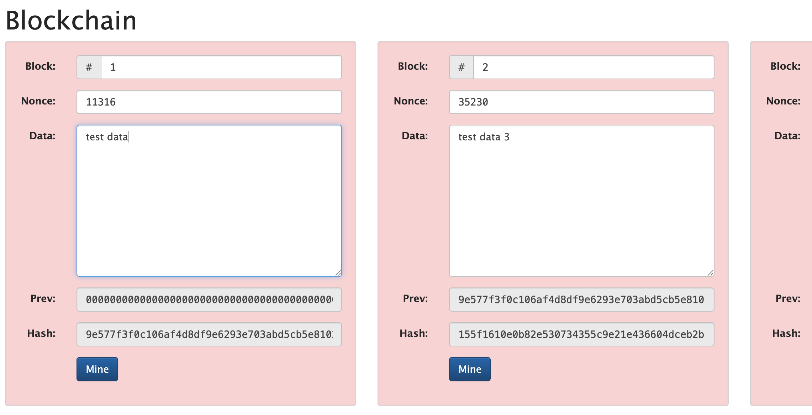
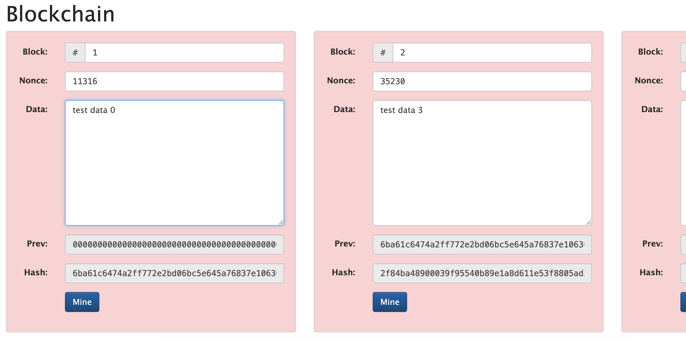

# Эксперимент с генерацией блоков(Proof of Work)

Изменяя payload блока изменяется его хеш и хеш всей последующей цепочки блоков по причине того, что каждый последующий блок содержит хеш(поле prev) предыдущего.

До изменения поля Data

После изменения

# Валидация в Ethereum (Proof of Stake)

## Требования
Необходимо заблокировать 32 ETH в депозитном контракте и настроить три компонента программного обеспечения: execution client, consensus client и validator client. Также требуется обеспечить стабильное подключение к сети и регулярно обновлять ПО.

## Принцип отбора валидаторов
Основным параметром при выборе валидатора является объём заблокированных ETH (размер стейка): чем он больше, тем выше вероятность, что конкретный валидатор будет выбран для формирования нового блока или подтверждения уже созданных блоков другими участниками сети.

# Сравнение PoW и PoS

| Критерий | Описание |
|----------|---------|
| Энергопотребление | Зависит от механизма консенсуса: PoW (Proof‑of‑Work) требует значительных вычислительных ресурсов и электроэнергии, тогда как PoS и DPoS существенно энергоэффективнее.| 
| Скорость транзакций | Механизм консенсуса PoS и DPoS обеспечивают наиболее высокие скорости транзакций (TPS) в отличии от PoW по причине отсутствия необходимости выполнения оборудованием ресурсоемких операций. Блокчейны построенные на PoW консенсусе как правило ограничены 100-1000 TPS, когда PoS и DPoS имеют потенциал от 10000 до 1 млн TPS в зависимости от масштабирования сети.|
| Безопасность | PoW традиционно считается высокозащищённым тк обеспечивает гарантии неизменности истории, дороговизной атак (необходимость контроля большей доли хешрейта сети). PoS более подвержен long-range и finality атакам, но это компенсируется финансовой ответственностью валидаторов, высокими рисками финансовых потерь. DPoS консенсус наиболее уязвим к атакам, основанных на сговоре делегатов, но при этом, в случае выбора доверенных, надежных делегатов может обеспечить наибольшую безопаность сети при сохранении высокой производительности. Так же он защищен от изменения истории в сети, тк она контролируется ограниченным числом доверенных делегатов.|

# Расширенная таблица сравнения DPoS, PoS, Pow

| Тип | Скорость | Безопасность | Устойчивость к атакам| Требования к оборудованию|
|----------|----------|---------|---------|---------|
|PoW| Самая низкая в сравнении другими рассматриваемыми консенсусами из-за необходимости осуществления более сложных вычислительных задач. Скорость транзакций: до 7 (Bitcoin), до 25 (Ethereum на пике).  Время блока: ~10 минут (Bitcoin), ~13 секунд (Ethereum). | Обеспечивает высокий уровень безопасности за счёт необходимости в огромных финансовых вложениях в вычислительные мощности) и децентрализованной структуры сети. | Гипотетическая возможность осуществления атаки "51%" за счет захвата майнинга крупным вычислиельным пулом. Устойчив к long-range атакам благодаря вычислительной сложности и Sybil атакам. Так же обеспечивается высокая степень неизменности истории, что гарантирует валидность цепочки блоков. | Данный консенсус включает в себя самые высокие требования к оборудованию: необходимость в GPU фермах и специализированном майнинговом оборудовании ASIC (интегральные схемы). Так же необходимо обеспечивать эффективное охлаждение оборудования. Минимальные системные требования: GPU 4 gb ram, RAM 8gb. Пропускная способность: от 20 mbit/s.| 
|PoS| Выше, чем у PoW, но ограничена необходимостью консенсуса среди относительно большого числа валидаторов. Может достигать 100k и более TPS в зависимости от шардинга. | Высокая из-за принципа личной финансовой ответственности валидаторов и большого количества валидаторов. | Атака "51%" возможна, но из-за риска финансовых потерять может быть крайне не рентабельна. Так же стоимость токена может упась в случае освещения атаки и стейкер рискует потерей активов. Так же уязвим к long-range и finality атакам, но защищён экономическими стимулами. | Оборудование должно обеспечивать стабильность при пиковых нагрузках и высокую доступность. Минимальные требования(от): 4 ядра CPU(2.4GHz+), 8 gb RAM DDR4/DDR5, SSD от 500gb, пропусканя способность сети от 500mbit/s с пингом до основных узлов менее 50ms.|
|DPoS| Может быть выше чем у PoS за счет меньшего количества участников в консенсусе, чёткой очереди создания и ротации блоков и быстрого достижения консенсуса из-за ограниченной группы (в сравнении с PoS) валидаторов. Потенциально может достигать 1 млн. TPS в зависимости от блокчейна и специфики развертывания. | Уязвимости схожи с PoS, но может быть менее децентрализованным. | Защищен от "nothing at stake", "long‑range" и "Sybil" атак, так как история сети жёстко контролируется делегатами, поэтому пересоздание старых блоков крайне затруднено и доступ к валидации получают только избранные делегаты. Подвержен атаке сговора делегатов, атака на избирательную систему(подкуп валидаторов) и атаке 51% за счет подкупа валидаторов тк число валидаторов меньше чем в PoS. | Т.к в в данном консенсусе участвует меньшее число валидаторов, требования к пропускной и вычислительной способностям, отказоустойчивости и сетевой доступности существенно выше. Минимальные требования(от): 8 ядер CPU(3.2GHz+), 16 gb RAM DDR4/DDR5, SSD от 1TB, пропусканя способность сети 1Gbit/s + резервный канал с пингом до основных узлов менее 50ms. |

# Вывод

На основании изученной информации предполагаю что алгоритмы PoS является оптимальными в отношении
безопасности к производительности, а так же энергоэффективны в отличии от PoW.
В отличии от DPoS он имеет куда меньший риск сговора делегатов и влияния на процесс голосования из-за большей децентрализации, а так же возможности проведения атаки 51%.
Штрафы для валидаторов PoS и хорошее масштабирование сети обеспечат наибольшую безопасность и высокую производительность.
